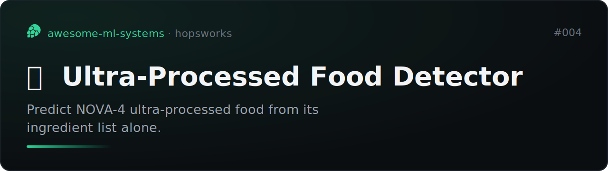

# Ultra-Processed Food Detector (planned)

One small ML system per day on Hopsworks.

Predict whether a food product is NOVA-4 ultra-processed from its ingredient list
alone (TF-IDF over ingredients text).

Data: [Open Food Facts](https://world.openfoodfacts.org/data) (free, open, 3M+
products with ingredient text and a NOVA group label). A real datasource to
connect to via a Hopsworks storage connector or DLTHub ingestion.

Status: **planned.** Repo scaffolded; not built yet. Will fork the
[readme-vaporware-score](https://github.com/MagicLex/readme-vaporware-score) base
patterns (collect -> feature group -> feature view -> train -> serve), same as
the asteroid project.

Why it is interesting: text-on-ingredients is a clean TF-IDF problem with a huge
free labelled dataset, genuinely useful, and a good exercise of Hopsworks
external data sources.
